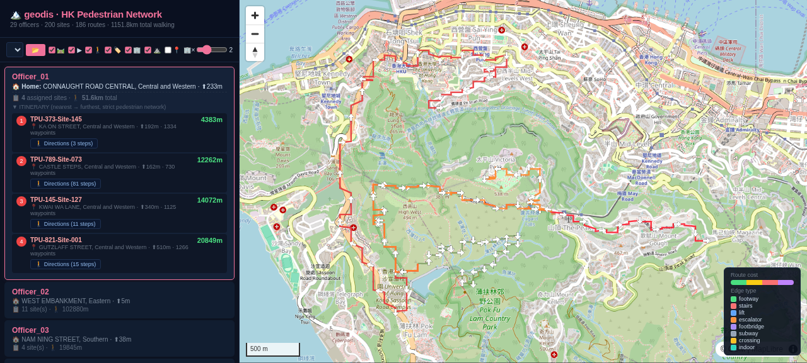

# geodis — Hong Kong Fieldwork Allocation & Pedestrian-Network Routing Engine

**A C++20 engine that allocates logistics to recipient addresses across
Hong Kong's 18 districts, and produces turn-by-turn walking itineraries that
strictly follow the Lands Department 3D Pedestrian Network.**

Built on the [HK Lands Department 3D Pedestrian Network](https://portal.csdi.gov.hk/geoportal/)
(465,475 route segments, ~19,000 km) with real street names from the government
Road Centreline dataset.



---

## 1. Cluster allocation algorithm

Delivery workers are allocated addresses with a **greedy balanced clustering**
algorithm (`--mode cluster`):

1. **Snap** every delivery worker and recipient address to its nearest pedestrian-network
   node using an R-tree spatial index.
2. **Build a full distance matrix** — one parallelised Dijkstra per delivery worker
   (TBB) gives the network walking cost from that delivery worker to every address.
3. **Assign each address** to the delivery worker that minimises the penalised score:

```
score[o] = walking_cost[o][s] × (1 + load_penalty × assigned_count[o])
```

   where `assigned_count[o]` is how many addresses delivery worker `o` already has, and
   `load_penalty` defaults to **0.15** (each existing assignment adds a 15%
   distance penalty). This keeps workloads balanced instead of dumping every
   address on the nearest delivery worker.

4. **Route geometry + narrative** are produced for every assignment by
   reconstructing the shortest path and merging consecutive edges of the same
   travel mode.

```
Walk along the footway for 375m (up 9.2m)
Climb the stairs for 102m (down 31.4m)
Cross the road crossing for 8m
Cross the footbridge for 48m
Take the lift for 12m
```

The Hungarian (optimal 1-to-1) and greedy nearest-neighbour solvers remain
available via `--mode hungarian` / `--mode greedy`.

---

## 2. Pedestrian network use

- Source: Lands Department **3D Pedestrian Network** — 465,475 route segments,
  **1,430,759 nodes** and **2,996,289 directed edges** covering footways,
  footpaths, stairs, lifts, escalators, footbridges, subways, crossings and
  indoor passages.
- `scripts/preprocess.py` converts the CSDI GeoJSON into a memory-mapped binary
  graph (`data/graph.bin`) with CSR adjacency.
- Every itinerary is a **sequence of real network nodes** — workers never walk
  off-network and never take a straight-line shortcut across the map.
- Walking cost penalises hills and stairs so routes prefer flat footways,
  bridges, lifts and escalators:

| Movement | Penalty |
|---|---|
| Flat footway | 1.0× length |
| Uphill footway | +5.0× ascent |
| Stairs | +8.0× ascent |
| Steep footpath (>10% grade) | ×8 |
| Lift | 10 m + 0.5× ascent |
| Escalator | ×0.5 |

---

## 3. Estimated allocation time

Measured on a 20-core machine (TBB enabled) against the full 1.43M-node graph.

**Benchmark (measured): 30 delivery workers × 200 addresses across 18 districts**

| Stage | Time |
|---|---|
| Graph load (1.43M nodes / 3.0M edges) | ~1.1 s |
| R-tree snapping | <0.1 s |
| Distance matrix (30 parallel Dijkstra) | ~2.1 s |
| Shortest-path geometry + narrative | ~3.0 s |
| **Total** | **~5.1 s** |

**Projected scaling (the "sorting time" table)**

The distance matrix scales with the number of delivery workers (parallelised), while
the per-address shortest paths scale with the number of addresses (currently
sequential at ~15 ms each) plus GeoJSON writing.

| delivery workers | Addresses | Estimated wall-clock |
|---|---|---|
| 30 | 200 | ~5 s (measured) |
| 100 | 1,000 | ~25 s |
| 200 | 5,000 | ~2 min |
| 500 | 10,000 | **~5–6 min** |
| 500 | 15,000 | ~8–9 min |

**Bottleneck & speed-up:** the per-address shortest-path loop is sequential.
Applying the same TBB parallel pattern used for the distance matrix cuts that
stage by ~20×, bringing the 500 × 15,000 case from ~8–9 min down to **~2 min**.
For that scale, output should be split per delivery worker (the single GeoJSON reaches
~4 GB at 15,000 routes) or written to a database/vector tiles.

---

## 4. 3D visualisation (Firefox)

Use the 3D MapLibre viewer (not the 2D snapshot pages):

```bash
python3 scripts/serve.py 8765
# open in Firefox:
# http://localhost:8765/scripts/map_viewer.html
```

**Steps:**

1. Click an delivery worker in the **left itinerary panel**.
2. **Wait ~30 seconds** for the 3D buildings to load from the Overpass API
   (they are fetched per viewport on the first pan/zoom).
3. The map shows the delivery worker's routes on the 3D terrain, with 3D buildings,
   and the left panel shows each site's **"🚶 Directions"** — the turn-by-turn
   walking narrative by footway / stairs / lift / escalator / footbridge /
   subway / crossing.


Toolbar toggles: 🛤️ routes · ▶ direction arrows · 🚶 full pedestrian network ·
🏷️ street names · 🏢 3D buildings · ⛰️ terrain · 📍 sites.

---

## 5. Quick start

```bash
# 1. Build the engine
cmake -S . -B build_native -G Ninja -DCMAKE_BUILD_TYPE=Release -DGEODIS_BUILD_VIEWER=OFF
ninja -C build_native geodis

# 2. Convert the CSDI pedestrian-network download to the binary graph
python3 scripts/preprocess.py data/pedestrian_route.json -o data/graph.bin

# 3. Group real street names by the 18 districts (from the government Road Centreline)
python3 scripts/build_street_districts.py

# 4. Generate 30 delivery workers + 200 addresses across 18 districts
python3 scripts/generate_district_data.py

# 5. Run the balanced cluster allocation
./build_native/geodis \
  --graph data/graph.bin \
  --delivery workers data/test_delivery workers_30.csv \
  --sites data/test_sites_200.csv \
  --mode cluster \
  --cluster-penalty 0.15 \
  --geojson scripts/routes.geojson \
  --output data/assignments_cluster.csv

# 6. Visualise
python3 scripts/serve.py 8765   # → http://localhost:8765/scripts/map_viewer.html
```

Input CSV (`name,address,lon,lat,z`); addresses use street name + district only,
e.g. `CONNAUGHT ROAD CENTRAL, Central and Western`.

---

## 6. Architecture

```
geodis/
├── CMakeLists.txt                      # CMake + Ninja build
├── src/
│   ├── main.cpp                        # CLI, GeoJSON + narrative output
│   ├── spatial/                        # point3d, haversine, R-tree, cost model
│   ├── graph/network_graph.*           # CSR graph + binary loader
│   ├── routing/dijkstra.*              # 3D Dijkstra
│   └── assignment/assignment_engine.*  # Hungarian / greedy / balanced cluster
├── scripts/
│   ├── preprocess.py                   # GeoJSON → binary graph
│   ├── build_street_districts.py       # group Road Centreline names by district
│   ├── generate_district_data.py       # 18-district delivery workers + addresses
│   ├── generate_network_data.py        # compact browser network.bin
│   ├── serve.py                        # local HTTP server
│   └── *.html                          # 3D/2D web viewers
└── docs/districts/*.png                # 3D viewer snapshots
```

## 7. Data attribution

- 3D Pedestrian Network © Lands Department, HKSAR Government (CSDI Portal)
- Road Centreline © Lands Department, HKSAR Government (CSDI Portal)
- OpenStreetMap © OpenStreetMap contributors (base map tiles / buildings)

Licensed under [CC BY 4.0](https://creativecommons.org/licenses/by/4.0/).
