# geodis — Hong Kong Fieldwork Allocation & Pedestrian-Network Routing Engine

**A C++20 engine that allocates fieldwork officers to survey addresses across
Hong Kong's 18 districts, and produces turn-by-turn walking itineraries that
strictly follow the Lands Department 3D Pedestrian Network — footways,
footbridges, subways, stairs, lifts, escalators and crossings.**

Built on the [HK Lands Department 3D Pedestrian Network](https://portal.csdi.gov.hk/geoportal/)
(465,475 route segments, ~19,000 km, covering every built-up area), with real
street names from the government Road Centreline dataset.

---

## 1. What it does

- **Snaps** officers and survey addresses to the nearest pedestrian-network node
  (R-tree spatial index).
- **Allocates** each address to an officer with a **load-balanced clustering
  algorithm** (each assignment adds a relative penalty to the officer, so no
  single officer is overloaded).
- **Routes** every itinerary along the pedestrian network using Dijkstra with a
  tuned walking-cost model.
- **Explains** each itinerary as a merged turn-by-turn narrative by travel mode:

```
Walk along the footway for 375m (up 9.2m)
Climb the stairs for 102m (down 31.4m)
Cross the road crossing for 8m
Cross the footbridge for 48m
Take the lift for 12m
Go through the subway for 95m
```

- **Visualises** everything in a web map (MapLibre 3D terrain + buildings +
  full pedestrian network + street-name labels).

### Walking-cost penalties (so workers don't walk up the hill)

| Movement | Penalty |
|---|---|
| Flat footway | 1.0× length |
| Uphill footway | **+5.0× ascent** |
| Stairs (footsteps) | **+8.0× ascent** |
| Steep footpath (>10% grade) | **×8** |
| Lift | 10 m flat + 0.5× ascent (cheap) |
| Escalator | ×0.5 (assisted) |

---

## 2. 18-district coverage

Officers and survey addresses are scattered across **all 18 districts**, using
real street names grouped by district from the government Road Centreline
dataset. Below are live snapshots of each district with its officers (blue),
survey addresses (red) and walking routes (green).

| Central and Western | Eastern | Southern |
|---|---|---|
| 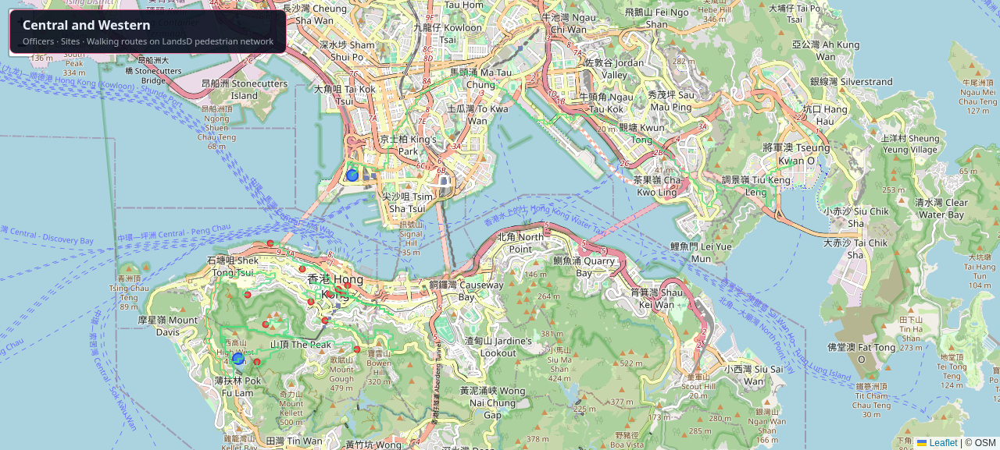 | 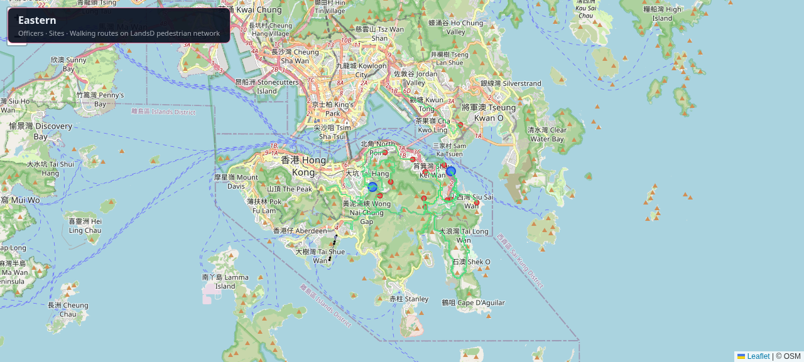 | 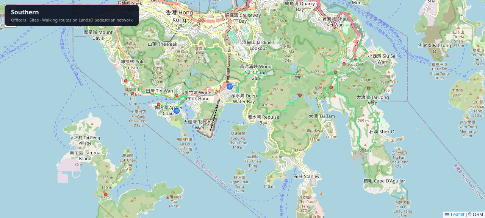 |

| Wan Chai | Kowloon City | Yau Tsim Mong |
|---|---|---|
| 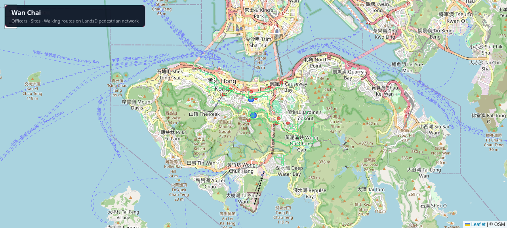 | 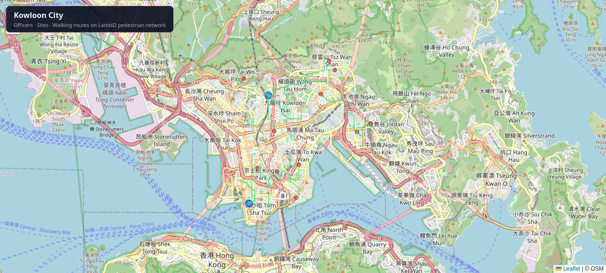 | 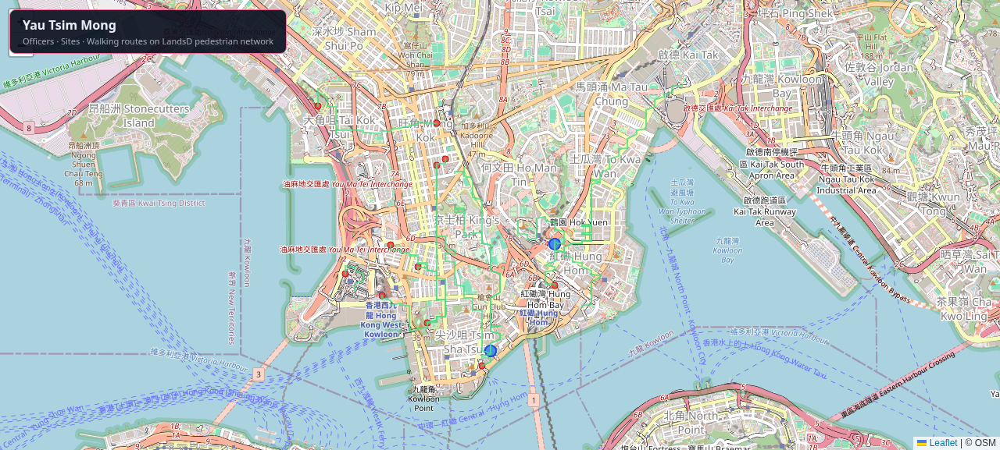 |

| Sham Shui Po | Wong Tai Sin | Kwun Tong |
|---|---|---|
| 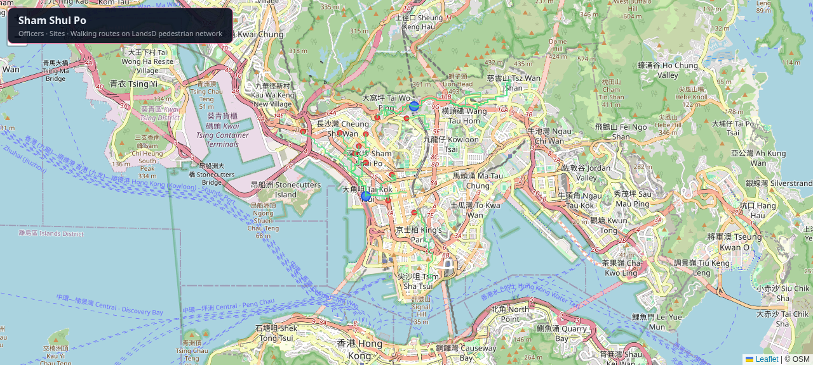 | 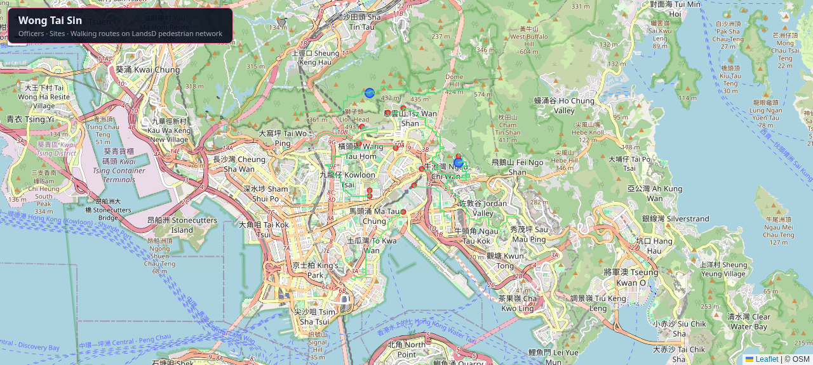 | 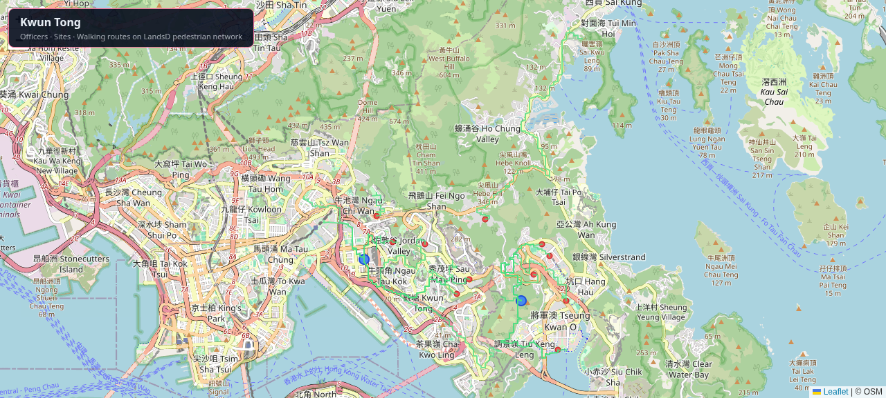 |

| Kwai Tsing | Tsuen Wan | Tuen Mun |
|---|---|---|
|  | 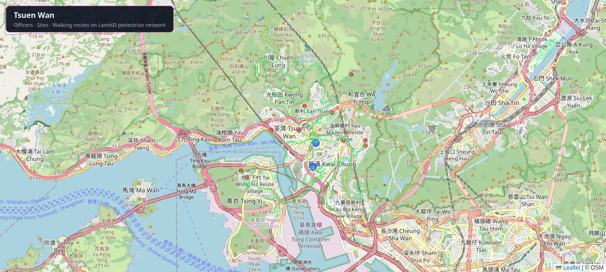 | 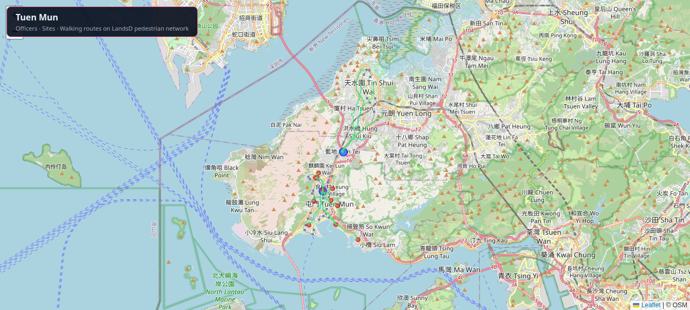 |

| Yuen Long | North | Tai Po |
|---|---|---|
| 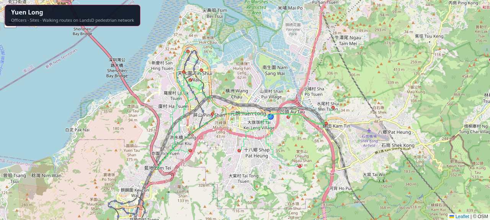 | 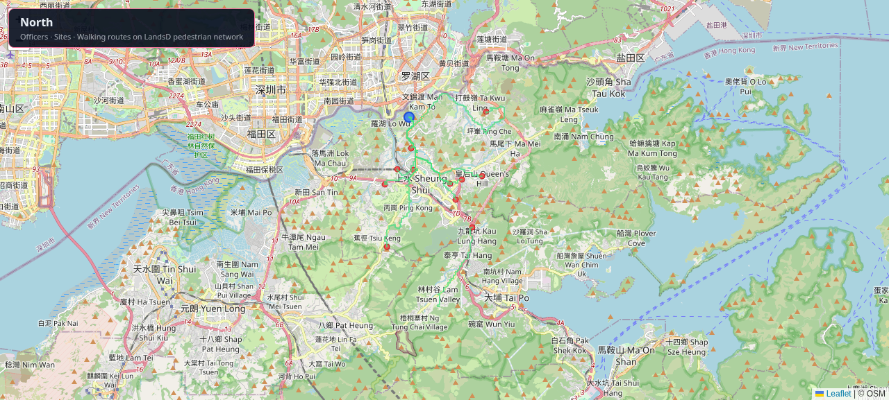 | 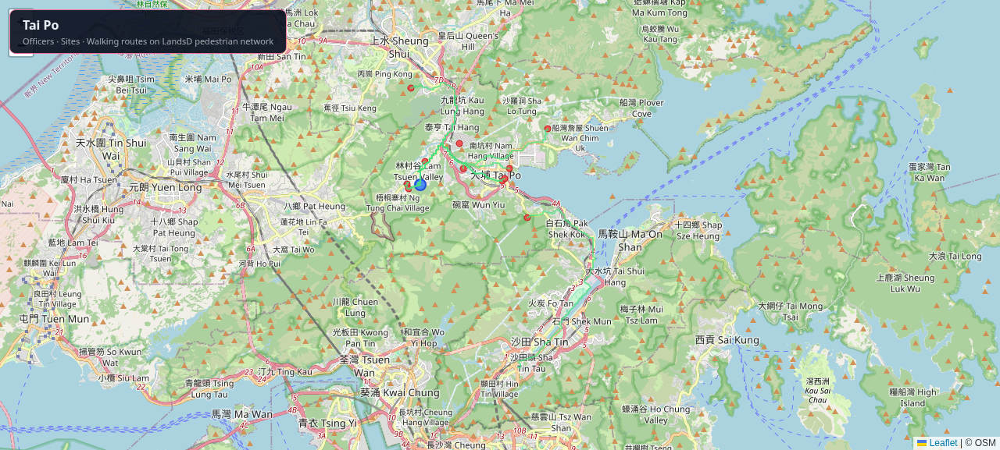 |

| Sha Tin | Sai Kung | Islands |
|---|---|---|
| 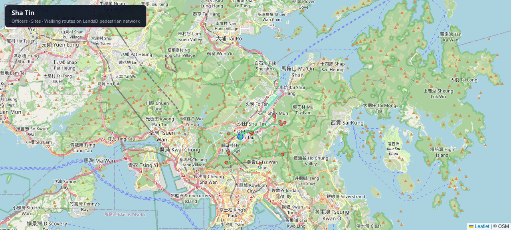 | 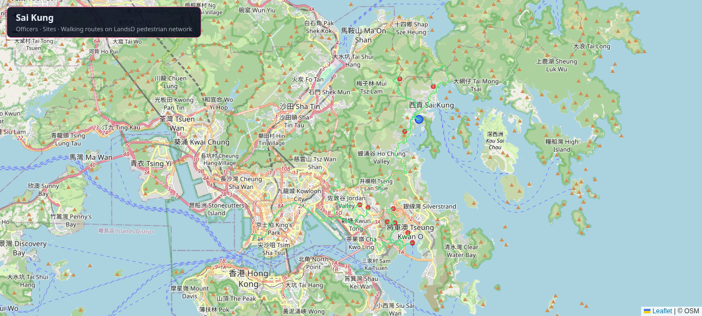 | 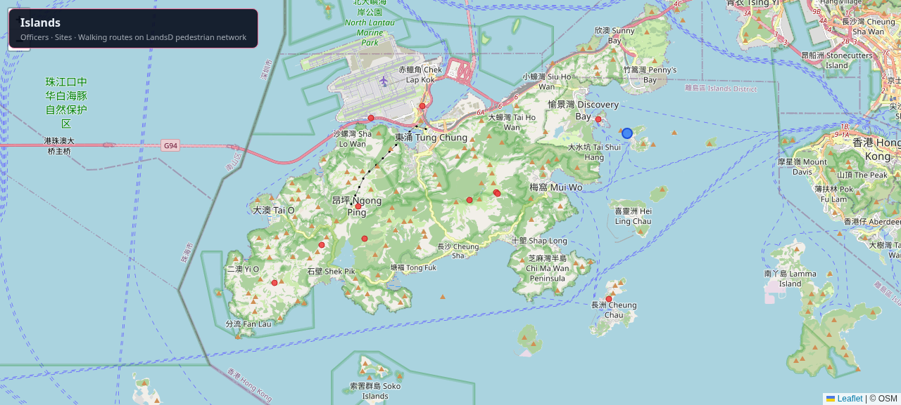 |

---

## 3. Estimated speed

Measured on a 20-core machine (Intel i7-class, TBB enabled) against the full
1,430,759-node / 2,996,289-edge network.

### Benchmark: 30 officers × 200 addresses (all 18 districts)

| Stage | Time |
|---|---|
| Graph load (1.43M nodes, 3.0M edges) | ~1.1 s |
| Snapping (R-tree) | <0.1 s |
| Distance matrix (30 parallel Dijkstra) | ~2.1 s |
| Shortest-path geometry + narrative | ~3.0 s |
| **Total** | **~5.1 s** |

### Projection: 500 officers × 15,000 addresses

| Stage | Estimated |
|---|---|
| Graph load + snapping | ~5 s |
| Distance matrix (500 parallel Dijkstra) | ~35 s |
| Shortest-path geometry (15,000 × ~15 ms, sequential) | ~3.75 min |
| Narrative + GeoJSON write (~4 GB output) | ~1 min |
| **Total** | **~5–6 minutes** |

**Bottleneck:** the per-route shortest-path loop is currently sequential. The
same TBB parallel pattern used for the distance matrix would cut the 3.75 min
to ~15–20 s, bringing the 500 × 15,000 total down to **~2 minutes**.

⚠️ For 15,000 routes the GeoJSON is ~4 GB — too large for one browser load.
Use per-officer split files, vector tiles, or a database/API for that scale.

---

## 4. Quick start

### Build

```bash
cmake -S . -B build_native -G Ninja -DCMAKE_BUILD_TYPE=Release -DGEODIS_BUILD_VIEWER=OFF
ninja -C build_native geodis
```

### Prepare the pedestrian network graph

```bash
# Convert the CSDI GeoJSON download to the binary graph:
python3 scripts/preprocess.py data/pedestrian_route.json -o data/graph.bin
```

### Generate 18-district officers + addresses

```bash
# First group real street names by district from the government Road Centreline:
python3 scripts/build_street_districts.py

# Then scatter 30 officers and 200 addresses across 18 districts:
python3 scripts/generate_district_data.py
```

### Run the allocation

```bash
./build_native/geodis \
  --graph data/graph.bin \
  --officers data/test_officers_30.csv \
  --sites data/test_sites_200.csv \
  --mode cluster \
  --cluster-penalty 0.15 \
  --geojson scripts/routes.geojson \
  --output data/assignments_cluster.csv
```

### Visualise

```bash
python3 scripts/serve.py 8765
# open http://localhost:8765/scripts/map_viewer.html
```

Click an officer to see their itinerary, then **"🚶 Directions"** for the
turn-by-turn walking narrative. Use the **🚶 network** and **🏷 street-name**
toggles to overlay the full pedestrian network.

---

## 5. Architecture

```
geodis/
├── CMakeLists.txt                     # CMake + Ninja build
├── src/
│   ├── main.cpp                       # CLI + GeoJSON/narrative output
│   ├── spatial/
│   │   ├── point3d.hpp                # 3D point, walking-cost model
│   │   ├── coordinate_utils.hpp       # haversine, HK1980 conversion
│   │   └── rtree_index.hpp/cpp        # R-tree snapping
│   ├── graph/network_graph.hpp/cpp    # CSR graph + binary loader
│   ├── routing/dijkstra.hpp/cpp       # 3D Dijkstra
│   └── assignment/assignment_engine.hpp/cpp  # Hungarian / greedy / cluster
├── scripts/
│   ├── preprocess.py                  # GeoJSON → binary graph
│   ├── build_street_districts.py      # group Road Centreline names by district
│   ├── generate_district_data.py      # 18-district officers + addresses
│   ├── generate_network_data.py       # compact browser network.bin
│   ├── serve.py                       # local HTTP server
│   └── *.html                         # web viewers
└── docs/districts/*.png               # 18-district snapshots
```

## 6. Data attribution

- 3D Pedestrian Network © Lands Department, HKSAR Government (CSDI Portal)
- Road Centreline © Lands Department, HKSAR Government (CSDI Portal)
- OpenStreetMap © OpenStreetMap contributors (base map tiles)

Licensed under [CC BY 4.0](https://creativecommons.org/licenses/by/4.0/).
